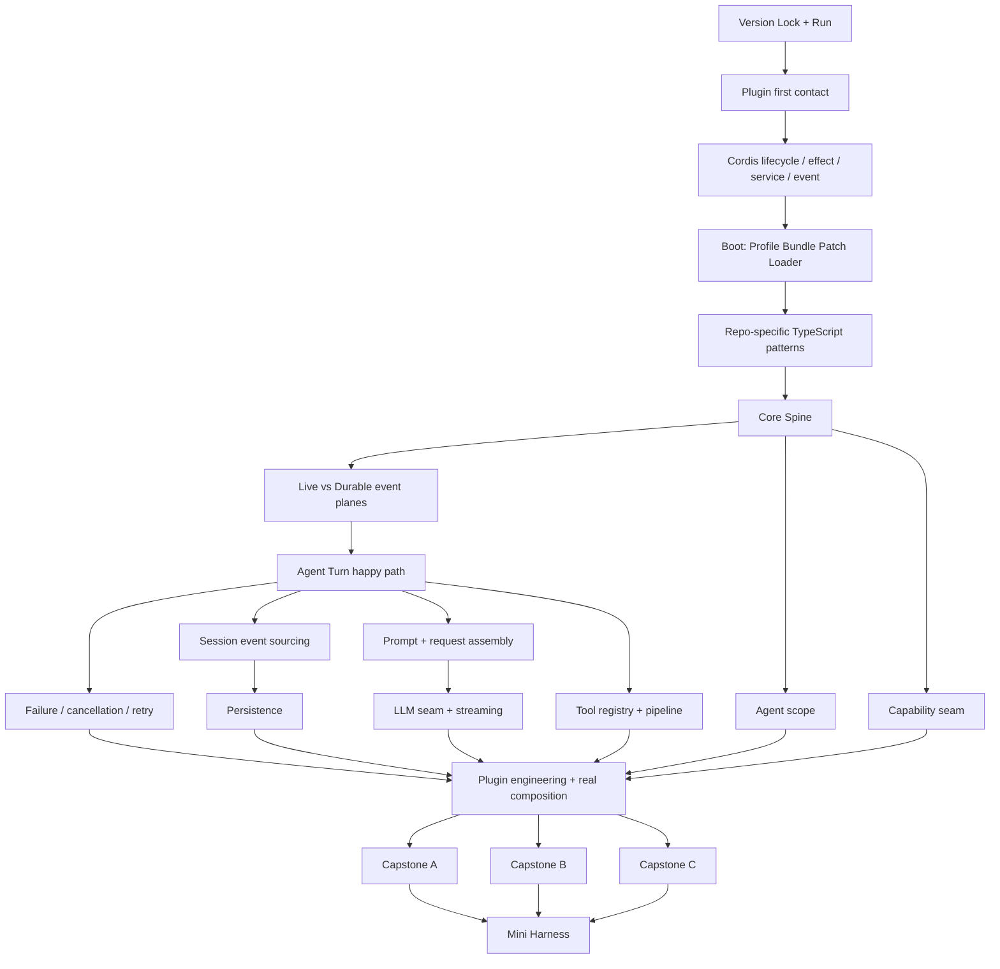

# Knowledge Dependency Graph

【教学模型】这张图描述“先会什么，才能可靠地学下一项”，不是官方 package graph。

## 为什么不是先学完整 Cordis？

【工程解释】先写一个最小真实 plugin，再系统学 Fiber/Effect/Service/inject/Event，能让 Cordis 的抽象都落到“这个 plugin 为什么会 pending / unload / reload”上。反过来先学完整框架，很容易变成无上下文的 API 记忆。

## 为什么 Event 双平面必须在 Agent Turn 前？

【工程解释】如果先追 Turn，学习者会在 `tools/result`（live）与 `tool/result`（durable）、`session/event`（live notification carrying a durable fact）之间混淆。先建立 control plane / durable data plane，后面的源码断点才不会把不同语义混成“都是事件”。

## 为什么 Mini Harness 最后？

【教学模型】Mini Harness 是闭卷考试，不是入门项目。过早实现会把自己的简化设计误投射到 DSH；三个 Capstone 完成以后再实现，才能检验“为什么这些抽象存在”。

## 内容预算

【教学模型】主线教学预算按学习时间而非页数：

| 模块 | 目标比例 |
|---|---:|
| 基础概念与环境 | ≤ 10% |
| Cordis 与 Composition | ≈ 20% |
| Core Runtime 与源码 | ≈ 35% |
| Plugin / Debug / 修改 | ≈ 25% |
| 高级扩展 | ≤ 10% |
| 通用 LLM / Agent 理论 | ≤ 5%（包含在上述模块，不额外扩张） |