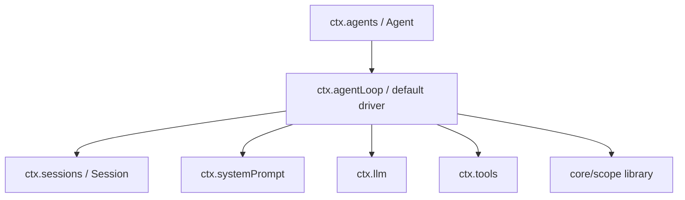

# Stage 6：Core Spine

## 毕业能力映射

【教学模型】直接服务于：**架构理解、源码导航、Core change 定位**。

## 先画 ownership，不先钻 implementation

【源码事实】当前 Core Spine 的主角：



【工程解释】箭头表示“运行时协作/driver 使用”，不是 npm dependency graph。真正 dependency 方向要看 `docs/module-graph.md`。

## Core Reading Card

| Package | Owns | Public contract / ctx | 主要 runtime 位置 |
|---|---|---|---|
| `core/session` | in-memory event-sourced session store/log | `ctx.sessions`, `Session` | 所有 durable facts |
| `core/system-prompt` | prompt/context/tool-schema registry + assembly | `ctx.systemPrompt` | pre-step/request assembly |
| `core/tools` | tool registry, policy/execution pipeline | `ctx.tools` | assistant tool-call dispatch |
| `core/agent` | Agent interface, Inbox, registry, event vocabulary | `ctx.agents` | live agent control plane |
| `core/agent-loop` | default concrete loop | `ctx.agentLoop` | turn/step/request/tool scheduling |
| `core/scope` | scope key/carrier/layers/owned registration | 无 service key | per-agent visibility/lifetime |
| `llm/llm` | model request/stream types + adapter registry | `ctx.llm` | prepare/stream model call |

## `Agent` 与 `AgentLoop` 不要混

【源码事实】`core/agent` 定义 Agent public interface / registry / live events；`agent-loop` 提供具体 factory/driver。

【工程解释】如果你写一个 plugin 只是观察/操纵 Agent，应依赖 `dsh-agent`。直接依赖 `dsh-agent-loop` 会把 extension 绑死在默认 driver。

## `Scope` 为什么算 Core 却没有 ctx key

【源码事实】`core/scope` 是 library primitive。`ReactLoopAgent` 构造器：

```ts
this.scope = createScope(loopCtx, this)
this.ctx = this.scope.ctx.extend({ agent: this })
```

【工程解释】scope 负责“注册的可见层 + 生命周期 owner”；Agent 只是当前 shipped loop 使用的 scope key。

## Lab：七张 1 页 Reading Card

【教学模型】对上表 7 个 package 各填一次 Source Reading Card，只读：

1. package README；
2. subsystem docs；
3. public source declaration；
4. tests 目录名。

先不读完整 implementation。

每张卡必须写：

```text
Owns:
ctx key:
Provider:
Consumers:
Live events:
SessionEvents:
Lifecycle:
Scope:
Config:
Key tests:
Docs:
One extension point:
```

## 验收

随机给出一个 Core package 名，60 秒内说出：

- 它 owns 什么；
- 它不 owns 什么；
- 它在一次 Turn 的哪个位置参与；
- 下一步要读哪个 source / test。

如果回答只停留在“Session 管消息、Tools 管工具”，未通过。