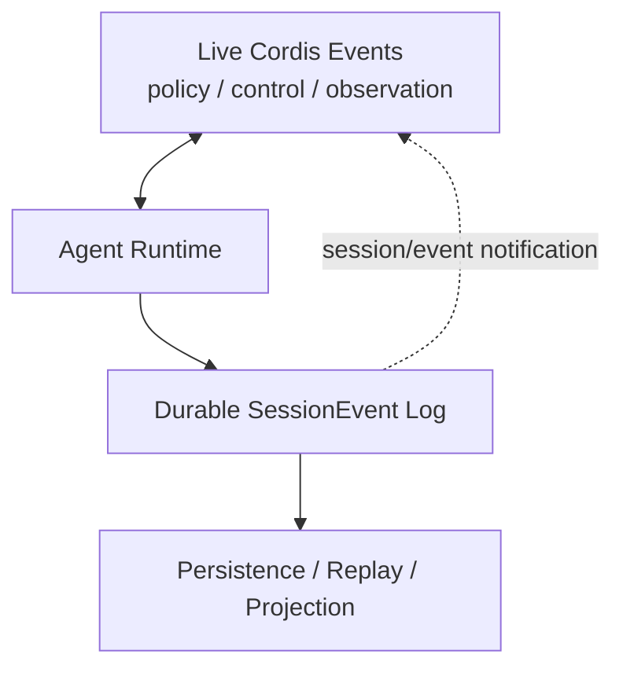

# Stage 7：事件双平面

## 毕业能力映射

【教学模型】直接服务于：**Hook 设计、调试、Agent Turn 源码阅读、Session replay**。

## Plane A：Live Cordis control / observation

【源码事实】当前 live events 典型包括：

```text
agent/created
agent/status
agent/inbox/*
agent/pre-step        waterfall
agent/request         waterfall
agent/request-error   waterfall
agent/turn-stopping   serial
llm/stream            waterfall
tools/pre-execute     waterfall
tools/execute         waterfall
tools/post-execute    waterfall
tools/result          synchronous notification
system-prompt/assemble waterfall
session/event         emit
session/flush         parallel
```

它们用于 interception、policy、coordination、observation。它们的事实地图是 `docs/event-producer-consumer.md`。

## Plane B：Durable SessionEvents

【源码事实】`SessionEventMap` 当前 core 事件包含：

```text
turn/start
turn/end
step/start
step/end
user/message
assistant/chunk
assistant/message
tool/call
tool/result
request/header
request/context
session/end-seed
...
```

插件还可 declaration-merge 额外 durable event。

## 最重要的一对：`tools/result` vs `tool/result`

```text
Tool Runtime pipeline
      │
      ├─ live: tools/result
      │     frozen authoritative runtime outcome
      │     适合观察、遥测、策略后的实时处理
      │
      └─ Agent Loop commits durable fact
            tool/result
            append 到 Session log
            可 replay / persistence / derive surface
```

【源码事实】`packages/core/agent-loop/src/tool-calls.ts::appendToolResult()` 负责把 final `ToolExecutionResult` 转成 `ToolResultMessage` 并 `session.append('tool/result', ...)`。

【工程解释】你要“拦截执行”时应该在 live plane；你要“保存一个可重放事实”时应该设计 SessionEvent。不要为了持久化去偷用 live observer，也不要为了 policy 去篡改历史日志。

## `session/event` 为什么最容易混淆

【源码事实】`session/event` 是 **Cordis live event**，payload 是刚追加的 durable `SessionEvent`。所以它是 bridge：

```text
session.append(durable event)
        ↓
ctx emits session/event (live notification)
        ↓
Persistence / UI / projections observe
```

`session/event` 本身不是额外写入 log 的一个 event type。

## Live Control Plane / Durable Data Plane



## Lab：同一次 Tool Call 看两种 event

【教学模型】写一个 plugin：

1. 监听 `tools/result`，记录 call id / result；
2. 监听 `session/event`，只筛 `event.type === 'tool/result'`；
3. 执行一次真实 Tool；
4. 输出时间顺序与字段差异；
5. 重启后从 persisted log 证明只有 durable plane 可以 replay。

## 需求判断练习

| 需求 | 应选平面 |
|---|---|
| 在 shell 执行前做组织策略 | live `tools/*` |
| 记录模型已经看见的 tool result | durable `tool/result`（正常由 loop 负责） |
| UI 实时显示 agent running/idle | live `agent/status` |
| 重启后恢复 model history | durable SessionEvent |
| 统计每次 runtime tool outcome latency | live tool observer / telemetry |
| 添加一种持久业务事实供 projection | 新 SessionEvent + projection |

## 验收

面对一个需求“我要拦截 / 我要保存 / 我要 replay / 我要观察”，能在 30 秒内判断 event plane，并指出错误选择会造成什么后果。