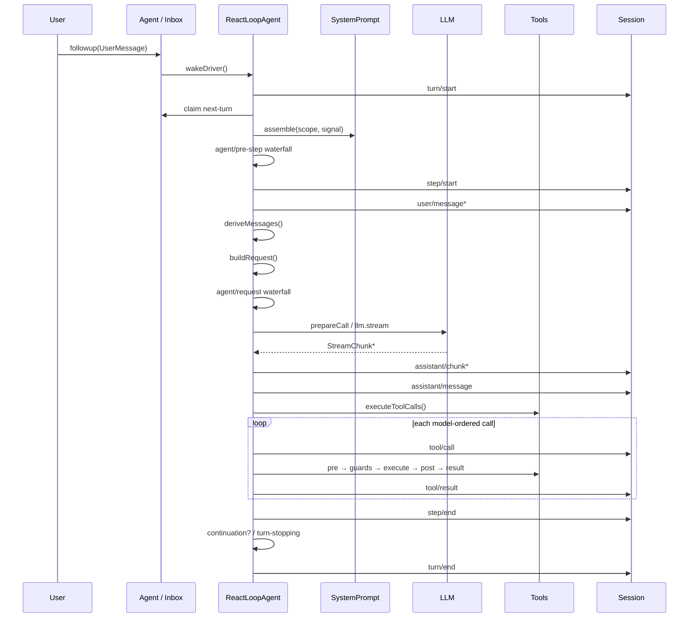

# Stage 8：追踪一次真实 Agent Turn

## 毕业能力映射

【教学模型】这是核心源码主线，直接服务于：**源码阅读、调试、Core 修改**。

## 先记方法名，不背流程图

【源码事实】当前 default driver class 是：

```text
packages/core/agent-loop/src/agent.ts
ReactLoopAgent
```

关键方法：

```text
send / followup / steer / inject
wakeDriver
kick
turn
preStep
step
buildRequest
```

Tool scheduling 在：

```text
packages/core/agent-loop/src/tool-calls.ts
executeToolCalls
runGroup
appendToolCall
appendToolResult
```

## 当前 Happy Path Sequence



## 源码逐站表

| 站点 | Source | Function / type | Service | Live event | Durable event |
|---|---|---|---|---|---|
| Input | `agent.ts` + `Inbox` | `followup`, `send` | `Agent` | `agent/inbox/inserted` | 尚无 |
| Turn open | `agent.ts` | `turn()` | driver | status | `turn/start` |
| Claim | `agent.ts` | `preStep()` | Inbox | `agent/inbox/claimed` | 尚无 |
| Prompt | `agent.ts` | `systemPrompt.assemble` | `ctx.systemPrompt` | `system-prompt/assemble` | runtime context 最终可变成 `user/message` |
| Pre-step | `agent.ts` | `dispatch.waterfall` | Agent event dispatch | `agent/pre-step` | decision enter 后才写 |
| Step open | `agent.ts` | `turn()` | Session | - | `step/start` |
| Enter | `agent.ts` | loop messages | Session | `session/event` bridge | `user/message` |
| History | `agent.ts` | `session.deriveMessages()` | Session | - | 从 log derive |
| Request | `agent.ts` | `buildRequest()` | LLM | `agent/request` | `request/header`, `request/context` when needed |
| Stream | `agent.ts` | `step()` + `BlockAssembler` | `ctx.llm` | `llm/stream` | `assistant/chunk` |
| Assistant | `agent.ts` | `createAssistantMessage` | Session | bridge | `assistant/message` |
| Tools | `tool-calls.ts` | `executeToolCalls` | `ctx.tools` | `tools/*` | `tool/call`, `tool/result` |
| Step close | `agent.ts` | finally | Session | - | `step/end` |
| Turn stop | `agent.ts` | `serial` | Agent events | `agent/turn-stopping` | - |
| Turn close | `agent.ts` | finally | Session | - | `turn/end` |

## Inbox：Followup / Steering / Injected Context

【源码事实】`followup()` → `next-turn` 且 wake；`steer()` → `next-step` 且 wake；`inject()` → `next-step` 但**不 wake**。

【工程解释】Injected Context 是“下一个 step 的候选输入”，不是“偷偷改当前 model request”。它要等 driver claim 后经 `agent/pre-step`，最后作为 durable `user/message` 进入 log，才变成模型可见历史。

## Debugger Lab

【教学模型】断点建议：

1. `ReactLoopAgent.followup()`；
2. `wakeDriver()`；
3. `turn()` 的 `turn/start`；
4. `preStep()`；
5. `session.append('step/start'...)`；
6. `buildRequest()`；
7. `for await (const chunk of stream)`；
8. `executeToolCalls()`；
9. `appendToolResult()`。

每次暂停都记录：`turn / step / inbox / session.events.length / signal.aborted`。

## 验收

关闭本页，不看 Mermaid，从 `followup()` 开始用 IDE 重走到 durable `tool/result`，同时指出每一段对应的 Service 与 live/durable event。