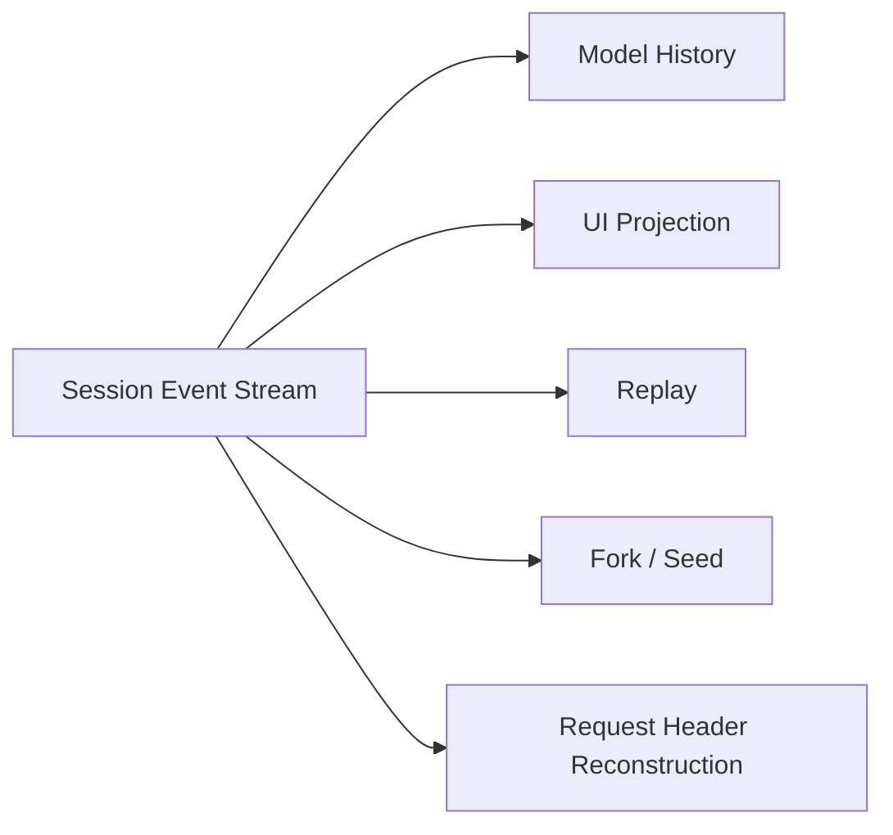

# Stage 10：Session Event Sourcing

## 毕业能力映射

【教学模型】直接服务于：**Session replay、源码阅读、独立 Harness 设计**。

## Session Log 是 source of truth

【源码事实】`Session` 是 append-only typed `SessionEvent` log；LLM message history 由 log 派生，不单独存一份 authoritative `messages[]`。

核心形态：

```text
SessionEventMap
      ↓ keyof
SessionEventType
      ↓ mapped discriminated union
SessionEvent<T>
      ↓ append-only seq
Session.events
      ↓
deriveMessages / projections / replay / fork
```

## 重要 durable event

【源码事实】核心 vocabulary：

- `turn/start`, `turn/end`
- `step/start`, `step/end`
- `user/message`
- `assistant/chunk`, `assistant/message`
- `tool/call`, `tool/result`
- `request/header`, `request/context`
- `todo/write`
- `session/end-seed`

加上其他 package declaration-merge 的 events。

## Surface ≠ 全部 Log

【源码事实】当前 `SurfaceEventType` 是：

```text
user/message
assistant/message
tool/result
```

只有它们直接构成模型 message surface。`assistant/chunk` 用于 token-level replay fidelity，却不直接变成一条额外 model message。

## Event Stream 的多种投影



## “Model-visible means logged”

【官方事实】Architecture 明确把这作为核心原则：会影响后续模型行为的内容必须能从 log 重建。

### 三个违反原则的反例

【教学模型】以下做法都错：

1. Hook 直接在 `GenerateOptions.messages` 临时塞一条用户指令，却完全不写 durable event。
2. Tool 执行后在内存变量里保存“下一轮模型必须知道”的额外 context，却不经 loop 的 deferred context → `user/message` 路径。
3. Resume 时重新读当前系统状态生成一条“历史上模型已经看过”的消息，但历史 log 没有这个事实，导致 replay 与原请求不同。

注意：system prompt / tool schemas 有自己的 `request/header` snapshot 机制；不是所有模型可见内容都必须变成 `Message`，但必须有可重构的 durable representation。

## `request/header`：不只是聊天历史

【源码事实】`EpochHeader` 保存本次 request 的 call config、rendered system prompt、tool schemas 与 adapter defaults；`buildRequest()` 在 initial/resume/change 时写完整 snapshot。

【工程解释】这让“某次 conversation request 是什么”可以从 log 重构，不依赖当下 registry 恰好长什么样。

## Lab：手写最小 Projection

【教学模型】读取一段真实 `session.events`，自己实现：

```ts
function projectSurface(events: readonly SessionEvent[]) {
  // 只先处理普通 append 的 user/message, assistant/message, tool/result
}
```

第一版不支持 compaction replace，先与无 compaction session 的 `deriveMessages()` 比较。

第二版再读 `SurfaceOp` / compaction docs，加入 replace semantics。

## Fork / Replay / Resume 边界

【源码事实】创建一个 seeded Session 与“恢复 persisted live agent”不是同一个 API：普通 replay/fork 可以 `ctx.sessions.create(id,{seed})`；persisted agent resume 走 `ctx.agents.resume(...)` + persistence preparation。

## 验收

> 为什么 DSH 可以只靠 event log 重新构建模型 history？哪些事件不进入 history，但仍是 replay 所需事实？

必须举 `request/header`、boundary/chunk 至少各一例。