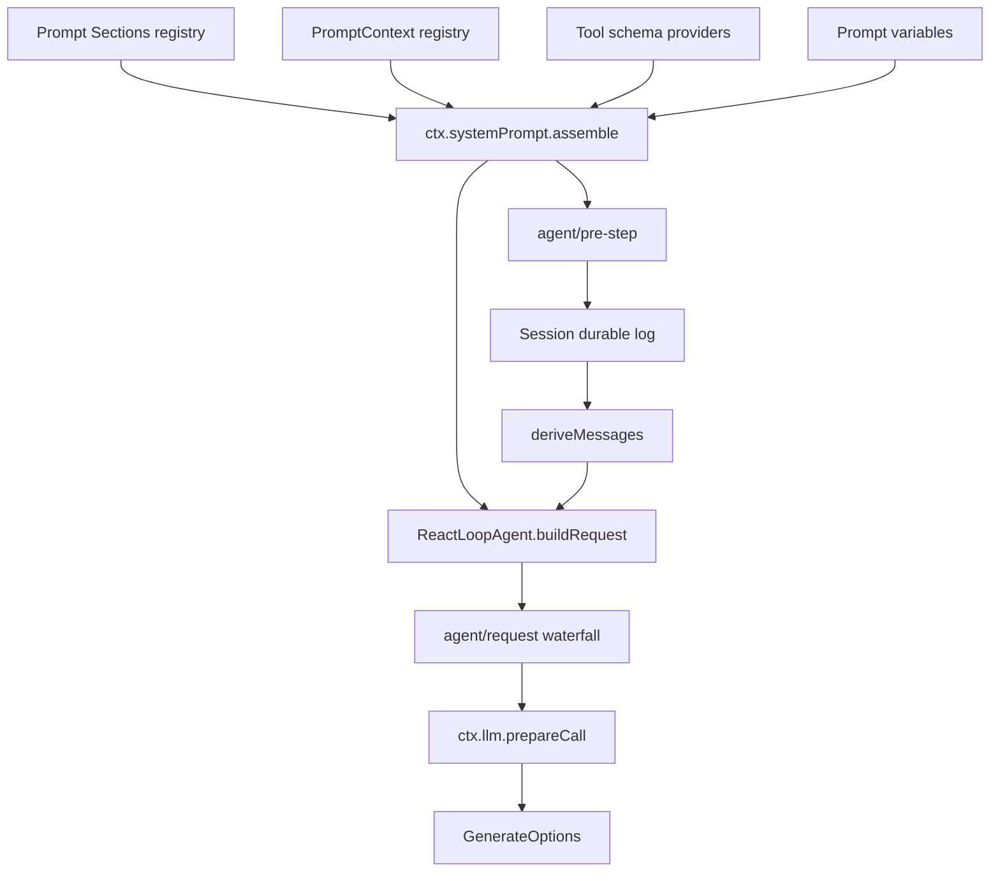

# Stage 12：System Prompt 与 Model Request Assembly

## 毕业能力映射

【教学模型】直接服务于：**Context Engineering、源码阅读、model-facing plugin、request 调试**。

## 不学 Prompt Engineering，学“谁把什么放进 request”

【源码事实】`ctx.systemPrompt` 当前提供：

```text
section(PromptSection)
context(PromptContext)
tools(provider)
variable(name, provider)
suppressRuntimeContext()
assemble(AssembleContext)
```

以及 live `system-prompt/assemble` waterfall。

## 当前 request assembly 主线



## 三种模型可见来源

### 1. Durable history

【源码事实】`Session.deriveMessages()` 从 durable surface events 形成 `messages`。

### 2. Registry contribution

【源码事实】System Prompt sections 与 tool schema providers 在每次 assembly 时按 global + scope 层解析；`renderPrompt(assembly)` 形成 system text。

【源码事实】当 `buildRequest()` 看到 request header initial/resume/change，会把最终 `config/system/tools` 记录为 durable `request/header` snapshot。

### 3. Runtime context contribution

【源码事实】`PromptContext` 被 assembly 解析后，`ReactLoopAgent.preStep()` 通过 `RuntimeContextProjection` 形成一个 runtime context `UserMessage`，默认加入 `agent/pre-step` 的 enter messages；真正进入 step 时再作为 `user/message` 持久化。

【工程解释】这就是为什么一个动态 context 不是“每次 request 临时插字符串”：它有 projection / dedupe / durable entry 的路径。

## Model selection

【源码事实】`buildRequest()` 先根据 Agent options / persisted header 构造 seed proposal，再经过 `agent/request` waterfall；随后 `ctx.llm.prepareCall(proposedConfig, signal)` 解析 adapter-owned defaults。最终 canonical header 再持久化。

【工程解释】“选择模型”与“真正发 HTTP”之间还有 request policy 和 adapter resolution 两层，调试时不要只看 AgentOptions。

## Lab：贡献一段可辨识 model context

【教学模型】写 plugin：

```ts
export const inject = ['systemPrompt']

export function apply(ctx: Context) {
  ctx.systemPrompt.context({
    name: 'course-marker',
    order: 50,
    text: () => 'COURSE_CONTEXT_MARKER=alpha-42',
  })
}
```

用 mock LLM capture `GenerateOptions`，同时监听 `session/event`。

要求回答：

1. marker 在最终 request 的 `messages` 还是 `system`？
2. 它对应哪个 durable event？
3. 第二个 step 如果内容不变，RuntimeContextProjection 是否重复追加？以实际 log 验证。
4. dispose plugin 后新 turn 还看得到历史 marker 吗？为什么？

## Lab：反向找贡献者

从捕获的最终 request 任意选：

- system prompt 一段文字；
- tool schema 一个 name；
- messages 中一个 context；
- provider/model/maxTokens；

反向找到：registry/provider → assembly/request code → durable representation。

## 验收

给一份最终 `GenerateOptions`，学习者能把每部分归类为：

```text
durable history
system-prompt registry
runtime context projection
agent/request policy
LLM adapter resolved defaults
```

并给 source path。