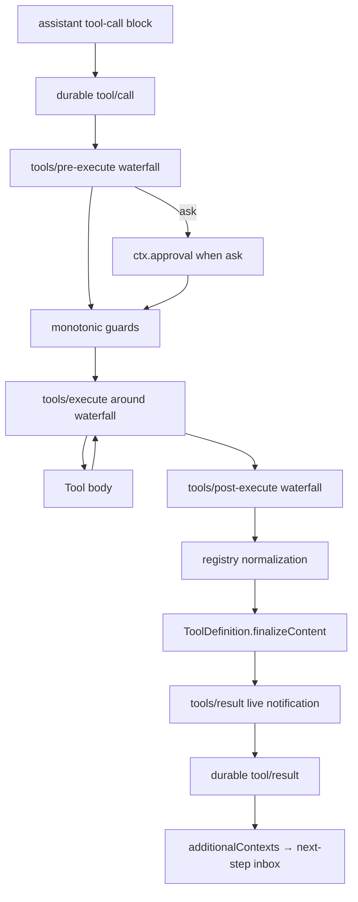

# Stage 14：Tool Registry 与 Tool Execution Pipeline

## 毕业能力映射

【教学模型】直接服务于：**Tool Plugin、Hook/Policy Plugin、Tool 调试、Core extension point 修改**。

## Tool Definition

【源码事实】`ToolDefinition` = model-facing `ToolSchema` + host-only execution contract。当前关键字段：

```text
name / description / parameters     → model-visible
output                              → canonical output schema + render
execute(args, ToolRunContext)       → body
timeoutMs?                          → host-only
isConcurrencySafe?                  → scheduler metadata
finalizeContent?                    → last-mile content invariant
presentCall? / presentResult?       → UI projection
```

【源码事实】`ctx.tools.schemas()` 明确 allowlist model-facing fields，host callbacks / timeout 不会泄漏到 model request。

## 当前真实管线



【源码事实】tool execution generated doc 还指出：Tool-fs 的 `fs/write-intent` / `fs/edit-intent` 位于 tool body 下层能力 policy gate；Tool-owned durable events 可在 body 期间产生。

## Lab 1：Tool Plugin

使用 `defineTool()`，不要手写 raw JSON Schema validator：

```ts
ctx.tools.register(defineTool({
  name: 'workspace_echo',
  description: 'Echo one bounded string.',
  parameters: {
    text: { type: 'string', required: true },
  },
  output: {
    schema: { type: 'string' },
    render: (_args, value) => [{ type: 'text', text: value }],
  },
  async execute({ text }, exec) {
    exec.signal.throwIfAborted()
    return text
  },
}))
```

用当前 `defineTool` 类型检查纠正 schema 细节。

## Lab 2：观察 Tool

在 `tools/pre-execute` 或 `tools/result` 注册 observer；若是 waterfall，必须 `next()`。

## Lab 3：拒绝 Tool

【教学模型】先读 `ToolPreExecution` / 当前事件 signature，返回官方 deny/ask decision，而不是 throw 一个任意异常。证明 tool body 未执行，但最终 outcome 仍经 post/finalization 形成一致结果。

## Lab 4：改结果

在 `tools/post-execute` 只修改允许的 result projection；然后观察 `finalizeContent`、live `tools/result`、durable `tool/result` 的最终值。

## Lab 5：timeout / cancel

【源码事实】`timeoutMs` 由 `@deepseek-ai/dsh-tool-call-timeout-policy` 作为 `tools/execute` wrapper 执行，Tool Definition 自己只声明预算。tool body 必须 forward/observe `exec.signal`。

故意让 tool 忽略 signal，观察“signal aborted ≠ 同进程 Promise 被硬杀”。再修成 cooperative cancellation。

## 并发调度

【源码事实】Agent Loop 先问 `ctx.tools.executionMode()`；parallel call 使用 bounded rolling pool，exclusive call 形成 barrier。pre/policy 与最终 post/result 保持 model order，只有 body dispatch 可以 overlap。

【工程解释】修改 Tool pipeline 时要明确你改的是：policy ordering、body dispatch、commit ordering 还是 model-visible result，不要用“工具并发”一个词概括。

## 组织级 shell policy 题

> “所有 shell 调用前加入组织级策略，未来 bash provider 替换成 sandbox/remote 仍必须生效。”

【教学模型】正确寻找路径：

```text
tool pipeline graph
→ tools/pre-execute / monotonic guard / approval ownership
→ identify bash by tool metadata/name only if public contract permits
→ policy plugin
```

不要修改 `tool-bash` body，更不要修改 `bash-local` provider。

## 验收

给任一 policy / telemetry / timeout / result transform 需求，能指出它应该位于 pre / guard / approval / execute / post / finalize / result 的哪一层，并说出为什么别层不合适。